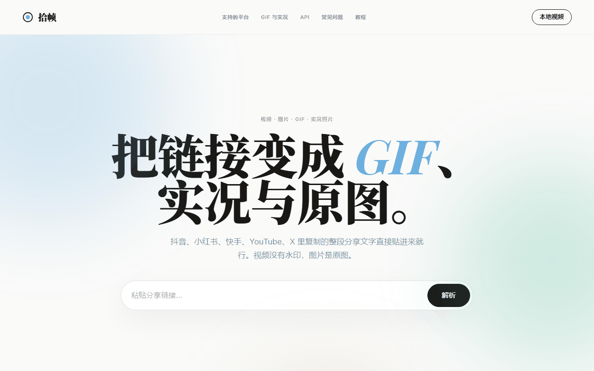
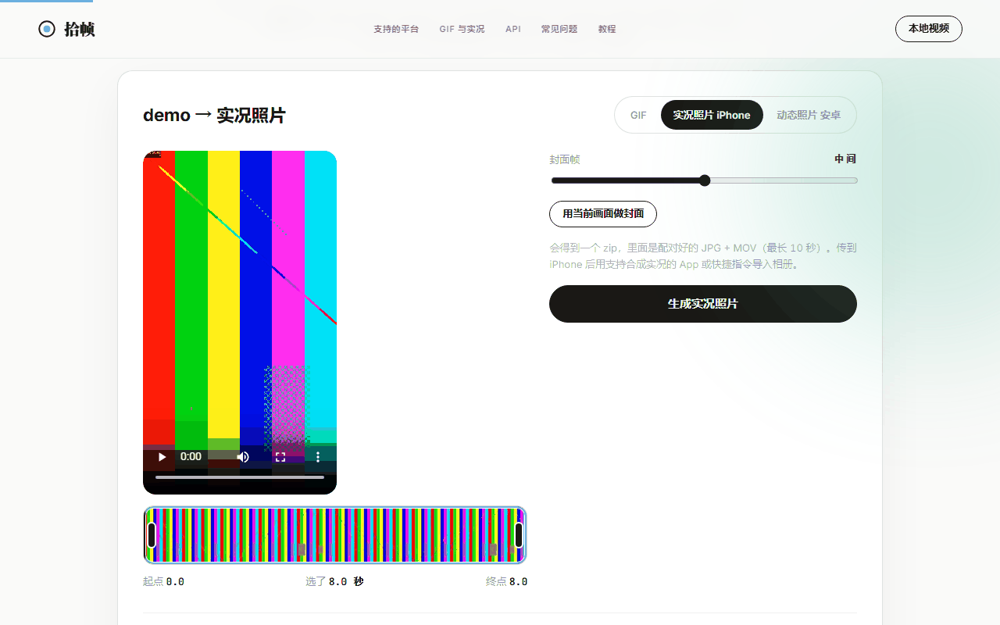
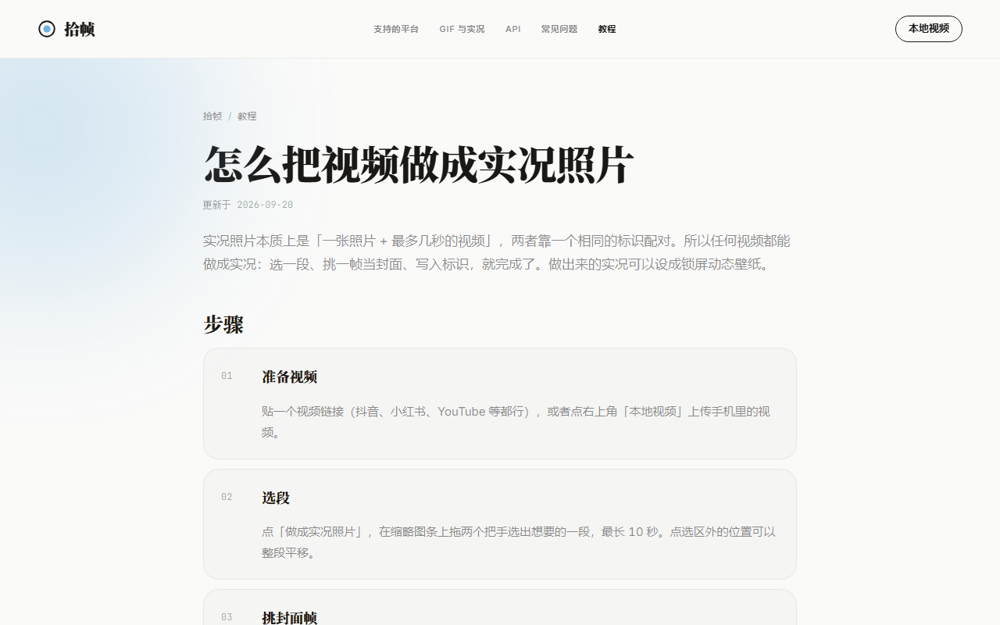
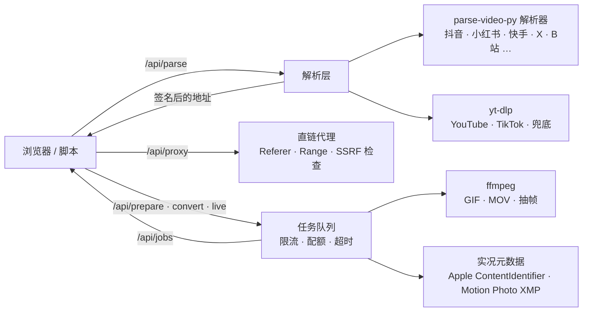

<div align="center">


# 拾帧 · Shizhen

**粘贴一个链接，取出无水印视频和原图，一键做成 GIF、iPhone 实况照片或安卓动态照片。**

支持抖音、小红书、快手、YouTube、X、B站等 30 多个平台。自部署，免费，不用登录。

**在线体验：[ynvan.com](https://ynvan.com)**

[](LICENSE)
[](pyproject.toml)
[](https://fastapi.tiangolo.com/)
[](https://github.com/yt-dlp/yt-dlp)
[](docker-compose.yml)
[](#-贡献)
[](https://ynvan.com)

[在线体验](https://ynvan.com) · [快速开始](#-快速开始) · [功能](#-功能) · [部署](#-生产部署) · [配置](#%EF%B8%8F-配置) · [API](#-api) · [架构](#%EF%B8%8F-架构) · [安全](#-安全) · [贡献](#-贡献)

</div>

<br>

<p align="center">
  
</p>

<table>
  <tr>
    <td width="50%"></td>
    <td width="50%"></td>
  </tr>
  <tr>
    <td align="center"><sub>任意视频截一段做成实况照片，封面帧自己挑</sub></td>
    <td align="center"><sub>教程页：每篇对准一个具体问题</sub></td>
  </tr>
</table>

---

## 目录

- [为什么做这个](#为什么做这个)
- [功能](#-功能)
- [支持的平台](#-支持的平台)
- [快速开始](#-快速开始)
- [生产部署](#-生产部署)
- [配置](#%EF%B8%8F-配置)
- [API](#-api)
- [架构](#%EF%B8%8F-架构)
- [安全](#-安全)
- [SEO](#-seo)
- [路线图](#%EF%B8%8F-路线图)
- [贡献](#-贡献)
- [致谢](#-致谢)
- [免责声明与许可](#%EF%B8%8F-免责声明与许可)

## 为什么做这个

短视频平台把内容锁在 App 里：保存的视频带水印，图片被压缩，实况图只剩静态一帧，想做个表情包还得再找一个工具。拾帧把这几步合成一次粘贴：

1. **解析**：贴上分享链接，拿到平台给网页端的无水印播放地址和原始尺寸图片。
2. **转换**：在缩略图条上拖出想要的几秒，直接生成 GIF、实况照片或动态照片。
3. **实况原样打包**：小红书 / 抖音自带的实况图，原图和短视频配好对，导入手机相册就会动。

解析层基于开源项目 [parse-video-py](https://github.com/wujunwei928/parse-video-py) 和 [yt-dlp](https://github.com/yt-dlp/yt-dlp)；本项目把两者整合起来，补上转换能力，并做成一个可以公开部署的网站。

## ✨ 功能

### 提取

| | |
|---|---|
| **无水印视频** | 取平台的播放地址，不做二次压缩。抖音额外给出 H.265 高清档和背景音乐；YouTube / B站 由服务端合并音视频后提供 1080p – 4K 与仅音频 |
| **原图** | 小红书按存储的原始分辨率取（常见 1920×2560），抖音图集取无水印的原始尺寸 JPEG，X 取原图 |
| **实况图** | 小红书、抖音图集里的实况（原图 + 短视频）识别出来并标记，可整篇打包 |
| **直链代理** | 服务端转发并补 Referer / UA，浏览器里直接播放、拖进度、保存，不会 403 |
| **错误分类** | 解析失败按「已删除 / 需登录 / 被限流 / 网络 / 链接过期」给出对应提示，而不是一句"解析失败" |

### 转换

| | |
|---|---|
| **GIF** | 拖缩略图条选段（≤ 30 s），可调帧率 5–30、宽度 160–960、速度 0.5–3×、三种抖动算法；两遍编码（palettegen + paletteuse） |
| **iPhone 实况照片** | 选段（≤ 10 s）+ 封面帧，输出配对好的 JPG + MOV（Apple `ContentIdentifier` 写在两边并回读校验），打包 zip |
| **安卓动态照片** | 一张内嵌 MP4 的 JPG（Google Motion Photo + 兼容旧版 MicroVideo 的 XMP），相册直接识别 |
| **实况原样打包** | 平台自带的实况图不重编码，MOV 只换封装，多张一起打包 |
| **本地视频** | 不解析链接也能转，上传即用（≤ 300 MB） |

### 网站

- 编辑风极简界面（衬线大标题 + 斜体强调、柔焦光晕、滚动入场、终端代码块），手机端完整适配，字体全部自托管，页面零外部请求
- 8 个平台 / 功能落地页 + 7 篇长尾教程，sitemap、canonical、Open Graph、JSON-LD（WebApplication / HowTo / FAQPage / 面包屑）
- 公网加固：按 IP 限流、任务配额与超时、磁盘配额、链接签名、SSRF 防护、CSP，Docker 非 root 运行
- yt-dlp 自动升级（平台改版靠它跟进），YouTube PO Token 服务一键接入

## 🌐 支持的平台

| 平台 | 视频 | 图集 | 实况图 | 清晰度 | 说明 |
|---|:-:|:-:|:-:|---|---|
| 抖音 | ✅ | ✅ | ✅ | 720p – 1080p，H.265 | 背景音乐可单独下载 |
| 小红书 | ✅ | ✅ | ✅ | 最高档 | 链接需带有效 `xsec_token`，现复制现用 |
| 快手 | ✅ | ✅ | – | 平台默认 | |
| YouTube | ✅ | – | – | 360p 直链，720p – 4K 服务端合并 | 需要时配置 PO Token / cookies |
| X (Twitter) | ✅ | ✅ | – | 最高码率 | 敏感推文走 fxtwitter 兜底 |
| B站 | ✅ | – | – | 480p 直链，720p / 1080p 服务端合并 | b23.tv 短链可用 |
| 微博、西瓜、皮皮虾、AcFun、TikTok、Instagram … | ✅ | 部分 | – | | 30+ 平台，其余站点交给 yt-dlp 兜底 |

> 解析依赖各平台网页结构，平台改版可能暂时失效。上游 parse-video-py 更新较勤，`parser/` 目录可直接同步。

## 🚀 快速开始

需要 **Python 3.10+**。ffmpeg 不用单独装：PATH 里有就用系统的，没有就自动用 `imageio-ffmpeg` 自带的。

```powershell
# Windows
git clone https://github.com/hiyufan/shizhen.git && cd shizhen
.\start.ps1
```

```bash
# macOS / Linux
git clone https://github.com/hiyufan/shizhen.git && cd shizhen
./start.sh
```

首次运行会自动创建 `.venv` 并安装依赖，然后打开 <http://127.0.0.1:8000>。

<details>
<summary>手动安装</summary>

```bash
python -m venv .venv
.venv/bin/pip install -e ".[web,cli]"      # Windows: .venv\Scripts\pip
.venv/bin/python main.py
```

</details>

<details>
<summary>Docker（单容器）</summary>

```bash
docker build -t shizhen .
docker run -d -p 8000:8000 -v ./data:/app/data shizhen
```

</details>

## 🐳 生产部署

一台 **4 核 / 8 GB / 100 Mbps** 的 VPS 就能跑。`docker-compose.yml` 带了三个服务：应用、[Caddy](https://caddyserver.com/)（自动 HTTPS 反代）、[bgutil-ytdlp-pot-provider](https://github.com/Brainicism/bgutil-ytdlp-pot-provider)（YouTube PO Token）。

```bash
# 域名先解析到这台机器
DOMAIN=your.domain PARSE_VIDEO_SITE_URL=https://your.domain docker compose up -d
```

不用 Docker 的话，自己起 Nginx / Caddy 反代到 `127.0.0.1:8000`，并设置 `PARSE_VIDEO_TRUST_PROXY=1` 让限流拿到真实客户端 IP。

**容量**：瓶颈按顺序是带宽（视频经服务器转发，100 Mbps 大约支持 10 个并发下载）→ ffmpeg 的 CPU（每个 GIF 占用一个核数秒）→ 平台风控（抖音 / 小红书会对单个出口 IP 限流）。配额和限流内置在应用里，默认值按 4 核、几百日活设定，均可通过环境变量调整。

**扩容**：任务状态在进程内存里，一个实例只跑 1 个 worker。横向扩容 = 多起几个容器 + 负载均衡开会话保持（Cookie 或 IP hash）+ 统一 `PARSE_VIDEO_SECRET`。再往上走时把任务状态搬到 Redis。

**风控**：`PARSE_VIDEO_PROXY` 可让解析走代理；YouTube 提示"确认不是机器人"时接 PO Token 服务（compose 已配好）或放一份 `cookies.txt`。

## ⚙️ 配置

全部通过环境变量，都可不填。

<details open>
<summary><b>基础</b></summary>

| 变量 | 默认 | 说明 |
|---|---|---|
| `PARSE_VIDEO_HOST` / `PARSE_VIDEO_PORT` | `0.0.0.0` / `8000` | 监听地址 / 端口 |
| `PARSE_VIDEO_DATA_DIR` | `./data` | 缓存、结果、密钥目录 |
| `PARSE_VIDEO_SITE_URL` | 按请求 | 正式域名，用于 canonical / sitemap / OG 图 |
| `PARSE_VIDEO_TRUST_PROXY` | `0` | 反代后面设 `1`，信任 `X-Forwarded-For` |
| `PARSE_VIDEO_USERNAME` + `PARSE_VIDEO_PASSWORD` | – | 同时设置则开启 Basic Auth |
| `PARSE_VIDEO_MCP` | `1` | 设 `0` 关闭 `/mcp`（Docker 镜像默认关） |

</details>

<details>
<summary><b>解析</b></summary>

| 变量 | 默认 | 说明 |
|---|---|---|
| `PARSE_VIDEO_PROXY` | – | 解析时使用的 HTTP 代理 |
| `PARSE_VIDEO_COOKIES_FILE` | `./cookies.txt` | yt-dlp 用的 Netscape 格式 cookies |
| `PARSE_VIDEO_COOKIES_BROWSER` | – | 直接从浏览器读 cookies：`firefox` / `edge` / `chrome` |
| `PARSE_VIDEO_POT_URL` | – | YouTube PO Token 服务地址，如 `http://bgutil:4416` |
| `PARSE_VIDEO_YTDLP_AUTOUPDATE_DAYS` | `0` | 每隔几天自动升级 yt-dlp 并在空闲时重启 |
| `PARSE_VIDEO_PARSE_CACHE` | `600` | 解析结果缓存秒数 |

</details>

<details>
<summary><b>配额与限流</b></summary>

| 变量 | 默认 | 说明 |
|---|---|---|
| `PARSE_VIDEO_MAX_JOBS` | CPU 核数 − 1 | 同时进行的下载 / 转换任务数 |
| `PARSE_VIDEO_MAX_QUEUE` / `PARSE_VIDEO_JOB_TIMEOUT` | `50` / `300` | 排队上限 / 单任务超时秒数 |
| `PARSE_VIDEO_MAX_JOBS_PER_IP` / `PARSE_VIDEO_MAX_STREAMS_PER_IP` | `2` / `4` | 单 IP 同时任务数 / 同时下载流数 |
| `PARSE_VIDEO_RL_PARSE` / `_RL_JOB` / `_RL_UPLOAD` / `_RL_PROXY` | `30` / `20` / `10` / `120` | 单 IP：每分钟解析数 / 每 10 分钟任务数 / 每小时上传数 / 每分钟代理请求数 |
| `PARSE_VIDEO_MAX_UPLOAD` / `PARSE_VIDEO_MAX_SOURCE` | 300 MB | 上传 / 原视频大小上限（字节） |
| `PARSE_VIDEO_DISK_QUOTA` | 8 GB | `data/` 目录配额，超了删最旧的 |
| `PARSE_VIDEO_SOURCE_TTL` / `PARSE_VIDEO_JOB_TTL` | 2 h / 1 h | 原视频缓存 / 转换结果保留时间 |
| `PARSE_VIDEO_FFMPEG_THREADS` | 自动 | 每个 ffmpeg 的线程数，默认按并发数分摊 |

</details>

<details>
<summary><b>安全与 SEO</b></summary>

| 变量 | 默认 | 说明 |
|---|---|---|
| `PARSE_VIDEO_SECRET` | 自动生成到 `data/secret.key` | 代理链接签名密钥，多实例必须统一 |
| `PARSE_VIDEO_SSRF_DNS` | `1` | 设 `0` 关闭域名解析检查（仅本机开着 fake-ip 代理调试时） |
| `PARSE_VIDEO_SITE_VERIFICATION` | – | 站长平台验证 `<meta>` 片段，原样输出到 `<head>` |
| `PARSE_VIDEO_ANALYTICS` | – | 统计代码片段（百度统计 / Umami / GA），输出到页面底部 |

</details>

## 🔌 API

网页用的就是这几个接口，快捷指令、脚本、自己的 App 都能接。上游 parse-video-py 的 `/video/share/url/parse`、`/video/id/parse`、`/mcp` 原样保留。

```bash
curl -s "https://ynvan.com/api/parse?url=https://v.douyin.com/xxxx/"
```

```jsonc
{
  "code": 200,
  "data": {
    "source": "douyin",
    "title": "…",
    "author": { "name": "…" },
    "duration": 25.2, "width": 720, "height": 1280,
    "video_url": "https://…/play/….mp4",
    "music_url": "https://….mp3",
    "images": [{ "url": "…", "live_photo_url": "…" }],
    "formats": [{ "label": "720p H.265", "url": "…", "filesize": 126185059 }],
    "sig": { "https://…/play/….mp4": "3f9c…" }          // 每个地址的签名，下面的接口都要带
  }
}
```

| 方法 | 路径 | 说明 |
|---|---|---|
| `GET` | `/api/parse?url=` | 解析分享文字 / 链接。失败时返回 `reason`：`deleted` `login` `blocked` `network` `timeout` `unsupported` `empty` `parse` |
| `GET` | `/api/proxy?url=&sig=&filename=&download=1` | 转发直链，支持 Range；只接受解析结果里签过名的地址 |
| `POST` | `/api/prepare` | `{url \| page_url, sig, title}` 把原视频缓存到服务端，返回 `source_id` 或后台任务 |
| `POST` | `/api/upload` | multipart 上传本地视频，返回 `source_id` |
| `GET` | `/api/source/{id}` · `/strip?n=` | 原视频（可拖动播放）· 缩略图条 |
| `POST` | `/api/convert` | `{source_id, format: gif\|livephoto\|motionphoto, start, end, fps, width, dither, speed, key_time}` |
| `POST` | `/api/live` | `{items: [{image_url, video_url, image_sig, video_sig}], format, title}` 平台实况图原样打包 |
| `POST` | `/api/download` | `{page_url, format_spec, sig, title}` 服务端用 yt-dlp 合并下载 |
| `GET` | `/api/jobs/{id}` · `/file` · `/preview` · `/video` | 任务进度 · 结果文件 · 实况封面 · 实况 MOV |
| `DELETE` | `/api/jobs/{id}` | 取消任务（仅发起者） |
| `GET` | `/api/health` | 队列、磁盘、yt-dlp 版本 |

任务接口都返回 `{id, status: queued|running|done|error, progress, message, filename, filesize}`，轮询 `/api/jobs/{id}` 直到 `done` 后取 `/file`。限流触发时返回 `429` 并带 `Retry-After`。

## 🏗️ 架构



```
main.py                          启动入口
src/parse_video_py/
  parser/                        上游解析器（抖音 / 小红书 / 快手 / X / B站 …），本项目增强了 douyin / redbook / twitter
  parser/ytdlp.py                yt-dlp 通用解析器，清晰度列表
  parser/errors.py               解析错误分类
  convert/ffmpeg.py              ffmpeg 封装：GIF、切段编码、抽帧、缩略图条、进度
  convert/livephoto.py           Apple MakerNote / MOV 标识、Motion Photo XMP
  convert/tasks.py               后台任务：拉原视频、转换、实况打包
  convert/jobs.py · store.py     任务队列、原视频缓存、磁盘配额
  convert/limits.py · net.py     限流、SSRF 防护、链接签名
  convert/updater.py             yt-dlp 自动升级
  web.py                         FastAPI 路由
  seo.py · guides.py             落地页与教程内容、JSON-LD、sitemap
  templates/                     base / index / guide / guides / 404
  static/                        自托管字体（衬线按站内用字子集化）、样式、OG 图
scripts/push_urls.py             百度主动推送 + sitemap ping
scripts/subset_fonts.py          改文案后重建衬线字体子集
docker-compose.yml · Caddyfile   一台机器的 HTTPS 部署
```

## 🔒 安全

这是一个会替用户抓任意链接、再把文件转发回去的服务，公开部署时主要防两件事：被当成开放代理 / SSRF 跳板，以及被恶意媒体文件打崩。

- **链接签名**：代理、准备、下载、实况打包只接受 `/api/parse` 签过名的地址（HMAC），别人不能拿你的服务器代理任意网址
- **SSRF 防护**：字面内网 IP、localhost、`.internal`、云元数据地址一律拒绝；域名先解析再放行；302 跳转每一跳都检查，上游解析器同样覆盖
- **响应头**：CSP、`X-Frame-Options: DENY`、`nosniff`、`Referrer-Policy`；`/docs` `/openapi.json` 关闭
- **进程**：容器以非 root 运行；ffmpeg / yt-dlp 走参数列表不经 shell；任务超时或取消会杀掉子进程；错误信息不带服务器路径
- **配额**：按 IP 限流、并发任务数、上传与原视频上限、磁盘配额

仍需注意：ffmpeg 和 yt-dlp 处理的是不可信媒体，应保持更新（yt-dlp 可自动升级，ffmpeg 通过重建镜像更新）；`cookies.txt` 属于账号凭证，只应存放在服务器上；服务本身没有登录机制，限流针对的是脚本滥用，带宽成本需要部署者自行评估。

## 🔍 SEO

- 首页拿泛词；8 个落地页各拿一个精确词（`/douyin` `/xiaohongshu` `/kuaishou` `/youtube` `/x` `/bilibili` `/gif` `/live-photo`），每页独立标题、描述、H1、三段独有正文与专属问答
- 7 篇教程对准长尾词（`/guides`），真能照着做的步骤，带 HowTo + Article + FAQPage + 面包屑，和落地页互链
- 标题 ≤ 30 汉字、描述 ≤ 80 汉字、每页一个 H1；sitemap（带 lastmod）、robots、canonical、OG 大图、百度 `applicable-device`；服务端渲染、gzip、静态资源内容哈希缓存一年

部署后的清单：设置 `PARSE_VIDEO_SITE_URL`；在百度 / Google / Bing 站长平台验证站点并提交 sitemap；运行 `python scripts/push_urls.py` 主动推送；国内服务器需要 ICP 备案；教程内容可分发到其它平台并链接回站点。

## 🗺️ 路线图

- [x] 30+ 平台解析，yt-dlp 兜底
- [x] GIF / iPhone 实况 / 安卓动态照片
- [x] 小红书、抖音实况图原样打包
- [x] 公网加固：限流、配额、签名、SSRF、CSP
- [x] 落地页 + 教程 + 结构化数据
- [ ] 任务状态搬到 Redis，多实例无状态扩容
- [ ] iOS 快捷指令：解析结果一键存入相册（含实况）
- [ ] 批量：一次解析多个链接 / 整篇图集打包下载
- [ ] 更多平台的实况图（微博、Instagram）
- [ ] 把抖音多档清晰度、小红书原图、X 兜底回馈给上游 parse-video-py

## 🤝 贡献

欢迎 Issue 和 PR。

```bash
git clone https://github.com/hiyufan/shizhen.git && cd shizhen
python -m venv .venv && .venv/bin/pip install -e ".[web,cli]" fonttools brotli
.venv/bin/python main.py
```

- **加平台**：在 `src/parse_video_py/parser/` 写一个 `BaseParser` 子类，在 `parser/__init__.py` 注册域名。返回 `VideoInfo`，直链多档清晰度放 `formats`（带 `url`），需要服务端合并的放 `format_spec`。
- **改文案**：落地页在 `seo.py`，教程在 `guides.py`。改完跑 `python scripts/subset_fonts.py --src <NotoSerifCJK OTF 目录>` 重建衬线字体子集。
- **同步上游**：`parser/` 里本项目改过的文件有 `douyin.py` `redbook.py` `twitter.py` `base.py` `__init__.py`，其余可直接覆盖。
- 提交前用真实链接验证：抖音、小红书、X、B站 各一条，三种转换格式各一次。

## 🙏 致谢

- [parse-video-py](https://github.com/wujunwei928/parse-video-py) — 国内平台解析器，本项目的地基
- [yt-dlp](https://github.com/yt-dlp/yt-dlp) — YouTube 与兜底解析
- [FFmpeg](https://ffmpeg.org/) / [imageio-ffmpeg](https://github.com/imageio/imageio-ffmpeg) — 所有转换
- [FastAPI](https://fastapi.tiangolo.com/) · [httpx](https://www.python-httpx.org/) · [piexif](https://github.com/hMatoba/Piexif) · [fontTools](https://github.com/fonttools/fonttools)
- [bgutil-ytdlp-pot-provider](https://github.com/Brainicism/bgutil-ytdlp-pot-provider) · [fxtwitter](https://github.com/FixTweet/FxTwitter)
- 字体：[Noto Serif SC](https://fonts.google.com/noto/specimen/Noto+Serif+SC)、[Inter](https://rsms.me/inter/)、[Playfair Display](https://github.com/clauseggers/Playfair)、[JetBrains Mono](https://www.jetbrains.com/lp/mono/)

## ⚖️ 免责声明与许可

本项目仅供个人学习与研究，请尊重内容创作者的版权，不要用于任何侵权用途。使用本项目部署的服务由部署者自行承担责任。

[MIT License](LICENSE) © 2026 hiyufan，包含上游 parse-video-py 的版权声明。
